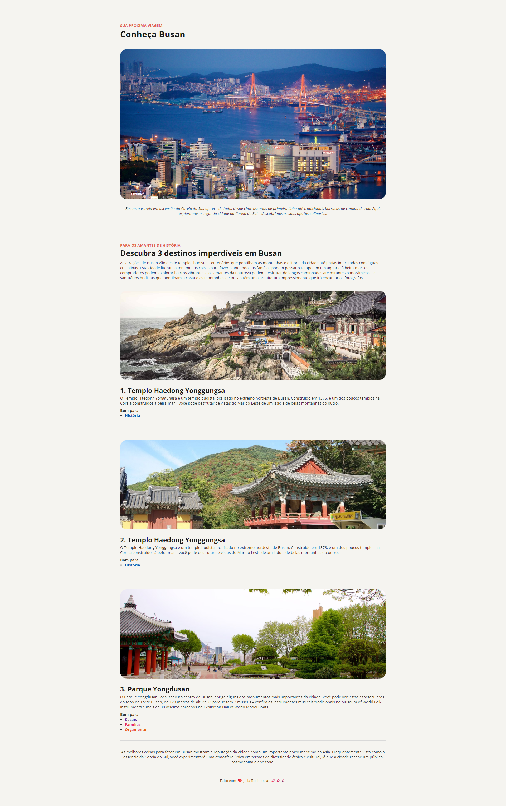

# Local Turístico 

A website with information about a specific local tourism.

### Prerequisites
It is not necessary to have a requirement.

## Planning 
You can assemble your ideas using [Figma](https://www.figma.com/)  

## Built with 
- [HTML](https://developer.mozilla.org/pt-BR/docs/Web/HTML) - markup language
- [CSS](https://developer.mozilla.org/pt-BR/docs/Web/CSS) - style language

## Authors 
Vinícius Marques Zaninelo - [Linkedin](https://www.linkedin.com/in/vin%C3%ADciuszaninelo/)